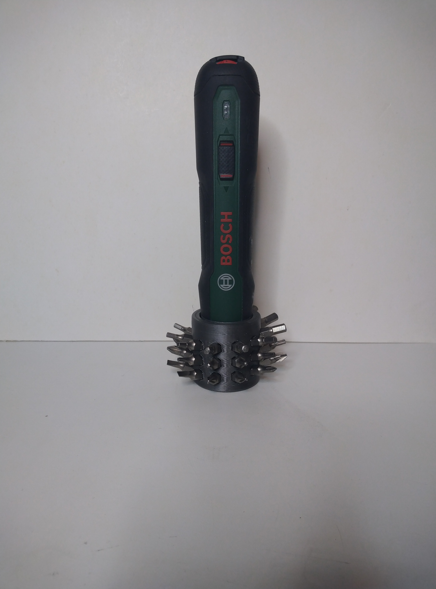
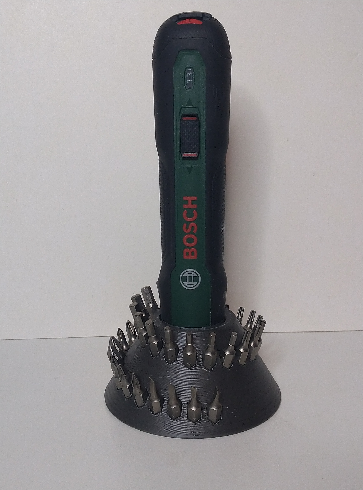

# Bosch Go stand
3D printable stand for Bosch Go electric screw driver (created with Rhino 6). 

I got a Bosch Go electric screw driver. It comes with 32 Bits in a small separat Box. The electric screw driver itself has had no stand. 
I created a stand with different versions. With or without bit-holders. You can stick it in the stand with a bit mounted.
I added a neodym magnet to the bottom side (26/12 mm h=9mm).

The stand consists of 1 part. There are different Versions. The bigger one can be used without magnet.

Requirements:
* 3D printer 
* Filament of your choice
* Neodym magnet 26/12/9 mm

#### View

